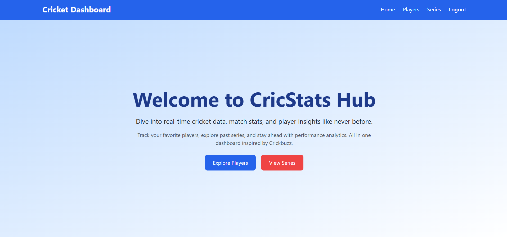
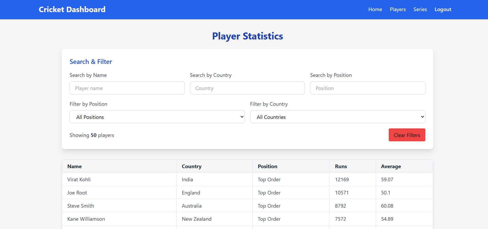
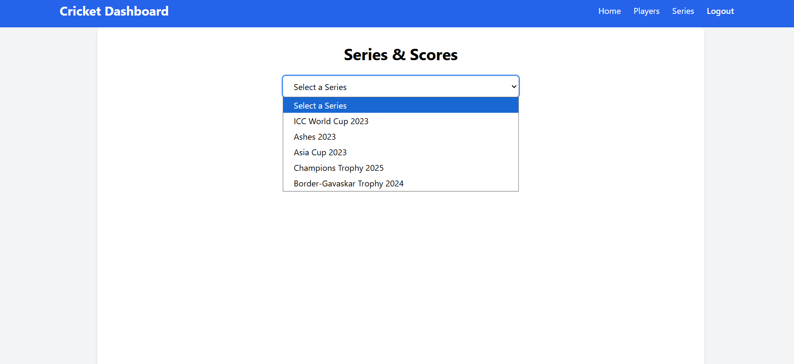
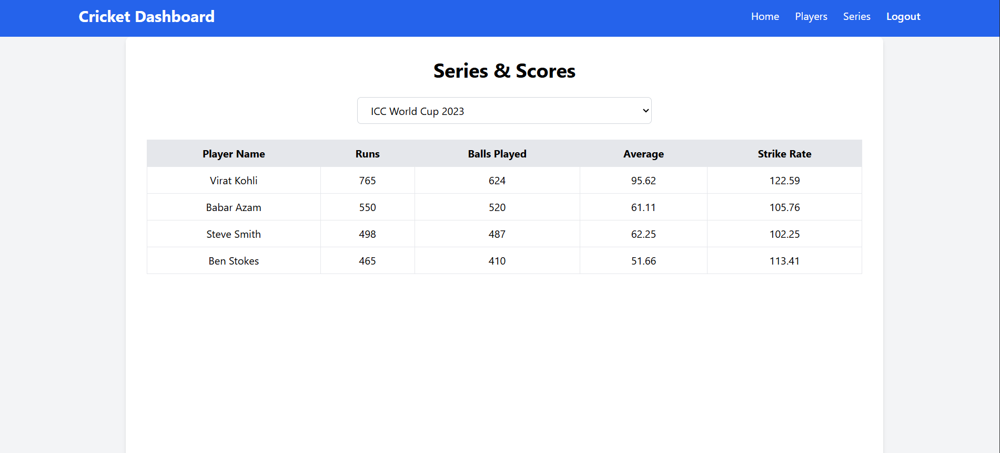

<<<<<<< HEAD
# 🏏 CrickScore App

CrickScore App is a responsive and dynamic **Cricket Dashboard** built using **React.js** and **Tailwind CSS**, inspired by Cricbuzz. It allows users to browse players, view match series, and filter stats with ease.

---

## 🚀 Features

- 🔍 **Search Players** by name, country, and position
- 📊 **Filter Players** by dropdown options
- 🏆 **Series Scores View** with player-wise stats
- 🌐 Fully **responsive layout** for mobile and desktop
- ⚡ Fast and clean UI built with **Tailwind CSS**

---

## 🛠️ Tech Stack

- React.js
- Tailwind CSS
- React Router DOM

---

## 📁 Project Structure


---

## 📦 Installation

1. **Clone the repository**

```bash
git clone https://github.com/Bhavesh193/CrickScore_App.git
cd CrickScore_App
npm install
npm run dev
```

Now open your browser and go to:
👉 http://localhost:3000

## 📸 Screenshots

### 🏠 Home Page



### 👥 Player List



### 🏆 Series Scores



